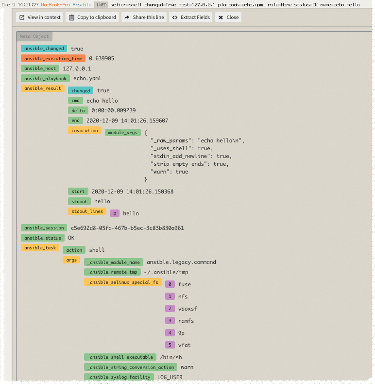

[](https://circleci.com/gh/logdna/ansible-logdna)

# Deploy LogDNA Agent with Ansible

## Description
Ansible Galaxy Role to install and configure LogDNA Agent

## Requirements
* Ansible version: `>=2.1`
* Tested on the following Operating Systems:
    * CentOS 6
    * CentOS 7
    * Ubuntu 12.04 - Precise
    * Ubuntu 14.04 - Trusty
    * Ubuntu 16.04 - Xenial
    * Ubuntu 17.10 - Artful
    * Debian 8 - Jessie

## Role Variables
### Task-specific Variables
* `agent_install`: `true` if to be installed (default: `true`)
* `agent_config`: `true` if to be configured (default: `true`)
* `agent_service`: (default: `started`), supporting:
    * `started`: to start LogDNA Agent Service if `conf_key` is specified
    * `restarted`: to restart LogDNA Agent Service
    * `stopped`: to stop LogDNA Agent Service.

### Configuration Variables
These variables map directly to the native configuration options for the LogDNA Agent:
* `conf_key`: LogDNA Ingestion Key - LogDNA Agent service will not start if `conf_key` is not specified
* `conf_config`: File Path for the LogDNA Agent configuration (defaults to `/etc/logdna.conf`)
* `conf_logdir`: Log Directories to be added
* `conf_logfile`: Log Files to be added
* `conf_exclude`: Log Files or Directories to be excluded
* `conf_exclude_regex`: Exclusion Rule for Log Lines
* `conf_hostname`: Alternative host name to be used
* `conf_tags`: Tags to be added.

## How to Install
* Online from Ansible Galaxy: `ansible-galaxy install logdna.logdna`
* Directly from Source Code: `ansible-galaxy install git+https://github.com/logdna/ansible-logdna.git`

## Example Playbook
```bash
- hosts: <hosts>
  vars:
    conf_key: <LogDNA Ingestion Key>
  roles:
     - { role: logdna.logdna }
```

## Use Cases
* To install, configure, and start the service on specified hosts:
```bash
- hosts: <hosts>
  vars:
    conf_key: <LogDNA Ingestion Key>
    # All other configuration parameter specifications
  roles:
     - { role: logdna.logdna }
```
* To reconfigure and restart the service on specified hosts:
```bash
- hosts: <hosts>
  vars:
    # reconfiguration parameter specifications
    agent_service: restarted
  roles:
     - { role: logdna.logdna }
```
* Just install but don't configure or touch the service:
```bash
- hosts: <hosts>
  vars:
    # do not set LogDNA Ingestion Key
    agent_config: false
  roles:
     - { role: logdna.logdna }
```
* Stop the service:
```bash
- hosts: <hosts>
  vars:
    agent_install: false
    agent_config: false
    agent_service: stopped
  roles:
     - { role: logdna.logdna }
```

## LogDNA Callback Plugin

The LogDNA Plugin is a callback handler that can send the logs for each playbook task back to your LogDNA instance. We capture the action, state, changed(true/false), host, playbook, role, status, and task name for the log line. Additionally we capture the internal variables from ansible as additional metadata for the playbook for search indexing.



#### Plugin Install Directions for Callback

The plugin can be installed with the following steps:

* Set your callback plugins folder for your ansible installation into a variable by running
  * `export PLUGIN_INSTALL_PATH=$(ansible-doc -F | awk 'FNR == 1 {print $2}' | sed 's/\/modules/+/g' | cut -d'+' -f 1)/plugins/callback`
  * This can also be installed in the `callback_plugins` directory in the root of your playbook if you wish to avoid a global installation.
* Download the LogDNA callback plugin from [here](https://raw.githubusercontent.com/logdna/ansible-logdna/master/lib/ansible/plugins/callback/logdna.py) into your callback plugins directory.
  * Using wget `wget -P $PLUGIN_INSTALL_PATH https://raw.githubusercontent.com/logdna/ansible-logdna/master/lib/ansible/plugins/callback/logdna.py`
  * Alternatively with curl `cd $PLUGIN_INSTALL_PATH && { curl -O curl -O https://raw.githubusercontent.com/logdna/ansible-logdna/master/lib/ansible/plugins/callback/logdna.py ; cd -; }`


#### Required Configuration for Callback
* If there is no `ansible.cfg` on your system, do the following steps:
  * Create a file in your home directory called `ansible.cfg` with the following values:
  * *NOTE: You can use any other valid ansible.cfg location as defined in the [ansible documenation](https://docs.ansible.com/ansible/latest/reference_appendices/config.html#the-configuration-file)*

```
[defaults]
callback_whitelist = logdna
[callback_logdna]
logdna_ingestion_key = VALID_INGESTION_KEY_GOES_HERE
logdna_tags = tag1,tag2
```

#### Optional Callback Options

This plugin supports these optional configuration options via `ansible.cfg` under heading `[callback_logdna]`

* `logdna_appname` will customize the default app name in the log viewer, default is `ansible`
* `logdna_host` LogDNA API endpoint host, default is `logs.logdna.com`
* `logdna_endpoint` LogDNA API endpoint resource to use, default is `/logs/ingest`
* `logdna_disable_loglevels` If defined as true will not transmit log levels in messages sent to LogDNA, default sends log levels.
* `logdna_hostname` If defined will set the default log source hostname value.
* `logdna_ignore_status_names` Status or comma-seperated list playbook status names to ignore log transmission to LogDNA for example: ok,failed,unreachable
* `logdna_ignore_action_names` Action or comma-seperated list playbook actions to ignore log transmission to LogDNA for example: gather_facts,shell,debug
* `logdna_ignore_role_names` Role or comma-seperated list role names to ignore log transmission to LogDNA for example: nginx,redis
* `logdna_ignore_play_names` Playbook or comma-seperated list playbook names to ignore log transmission to LogDNA for example: nginx.yml,redis.yml
* `logdna_ip_address` Override the system IP in your log message with an alternate value, default is autodetected.
* `logdna_log_format` Customize the log format of the log line sent to LogDNA.
  * Default value is `action={action} changed={changed} host={host} playbook={playbook} role={role} status={status} name={name}`
* `logdna_mac_address` Override the MAC address in your log message with an alternate value, default is autodetected.
* `logdna_tags` Optional, single tag or comma-seperated list of tags to optionally include with log events.
* `logdna_use_target_host_for_hostname` If defined as true, override the default hostname behavior to use the ansible target host as the host for logs sent to LogDNA.

All of these options can be set with environment variables in your shell

* LOGDNA_APPNAME
* LOGDNA_HOST
* LOGDNA_ENDPOINT
* LOGDNA_DISABLE_LOGLEVELS
* LOGDNA_HOSTNAME
* LOGDNA_IGNORE_STATUS_NAMES
* LOGDNA_IGNORE_ACTION_NAMES
* LOGDNA_IGNORE_PLAY_NAMES
* LOGDNA_IGNORE_ROLE_NAMES
* LOGDNA_INGESTION_KEY
* LOGDNA_IP_ADDRESS
* LOGDNA_LOG_FORMAT
* LOGDNA_MAC_ADDRESS
* LOGDNA_TAGS
* LOGDNA_USE_TARGET_HOST_FOR_HOSTNAME

## Contributing

Contributions are always welcome. See the [contributing guide](https://github.com/logdna/ansible-logdna/blob/master/CONTRIBUTING.md) to learn how you can help.

## License and Authors

* Authors:
  * [Samir Musali](https://github.com/ldsamir), LogDNA
  * [Jonathan Kelley](https://github.com/jondkelley), LogDNA
* License: MIT

